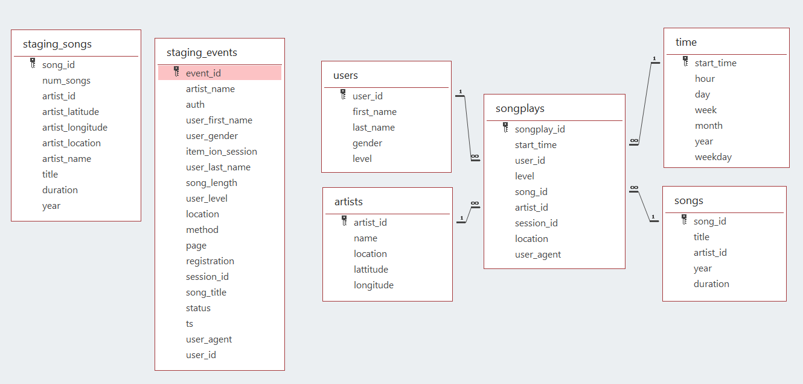

# Project 3: Song Play Analysis with S3 and Redshift
-------------------------

### Introduction

In this project, we try to help one music streaming startup, Sparkify, to move their user base and song database processes on to the cloud. Specifically, I build an ETL pipeline that extracts their data from **AWS S3** (data storage), stages tables on **AWS Redshift** (data warehouse with *columnar storage*), and execute **SQL** statements that create the analytics tables from these staging tables.

### Datasets
Datasets used in this project are provided in two public **S3 buckets**. One bucket contains info about songs and artists, the second bucket has info concerning actions done by users (which song are listening, etc.. ). The objects contained in both buckets 
are *JSON* files. 

The **Redshift** service is where data will be ingested and transformed, in fact though `COPY` command we will access to the JSON files inside the buckets and copy their content on our *staging tables*.

### Database Schema
We have two staging tables which *copy* the JSON file inside the  **S3 buckets**.
#### Staging Table 
+ **staging_songs** - info about songs and artists
+ **staging_events** - actions done by users (which song are listening, etc.. )

I createa a star schema optimized for queries on song play analysis. This includes the following tables.

#### Fact Table 
+ **songplays** - records in event data associated with song plays i.e. records with page `NextSong`

#### Dimension Tables
+ **users** - users in the app
+ **songs** - songs in music database
+ **artists** - artists in music database
+ **time** - timestamps of records in **songplays** broken down into specific units

The database schema is shown as follows

### Data Warehouse Configurations and Setup
* Create a new `IAM user` in your AWS account
* Give it AdministratorAccess and Attach policies
* Use access key and secret key to create clients for `EC2`, `S3`, `IAM`, and `Redshift`.
* Create an `IAM Role` that makes `Redshift` able to access `S3 bucket` (ReadOnly)
* Create a `RedShift Cluster` and get the `DWH_ENDPOIN(Host address)` and `DWH_ROLE_ARN` and fill the config file.

### ETL Pipeline
+ Created tables to store the data from `S3 buckets`.
+ Loading the data from `S3 buckets` to staging tables in the `Redshift Cluster`.
+ Inserted data into fact and dimension tables from the staging tables.

### Project Structure

+ `create_tables.py` - This script will drop old tables (if exist) ad re-create new tables.
+ `etl.py` - This script executes the queries that extract `JSON` data from the `S3 bucket` and ingest them to `Redshift`.
+ `sql_queries.py` - This file contains variables with SQL statement in String formats, partitioned by `CREATE`, `DROP`, `COPY` and `INSERT` statement.
+ `dhw.cfg` - Configuration file used that contains info about `Redshift`, `IAM` and `S3`

### How to Run

1. Create tables by running `create_tables.py`.

2. Execute ETL process by running `etl.py`.

